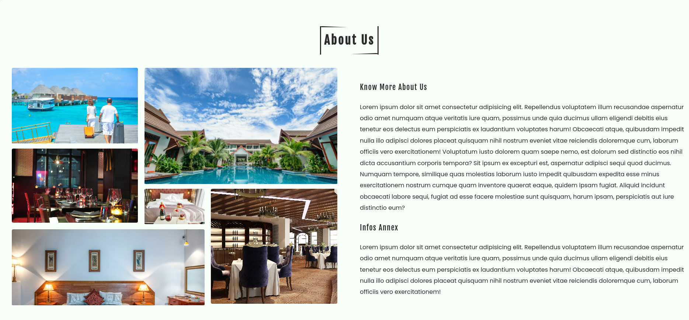

# Simple hotel's website design
This is a simple hotel's website design project built with HTML, CSS, and JavaScript. It's a landing page with a hero section, services section, and a menu section. The page is fully responsive and works great on both desktop and mobile devices.

Here is the link to the app:
<https://willem-aw.github.io/E-commerce-simple-Design/>

Here is a screenshot of the app:

---

---

---

The app is built with the following technologies:

* HTML for structuring the content
* CSS for styling the content
* JavaScript for adding interactivity to the content
